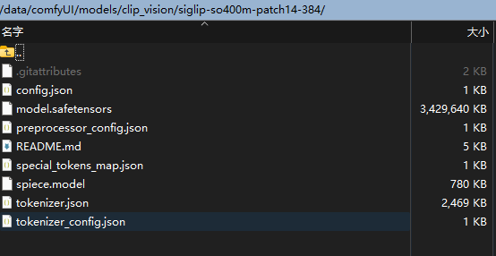

Update v1.0.2: Joy caption2 added.
# Introduction:
Joy Caption alpha 2 original demo and modelpackage:
https://huggingface.co/spaces/fancyfeast/joy-caption-alpha-two
the repo has taken some reference from: TTPlanetPig/Comfyui_JC2 and https://huggingface.co/John6666/joy-caption-alpha-two-cli-mod  

This report contains a "load many images" node which is going to load the image set by the number of file names from smallest to largest, and the images are NO LONGER loaded in the wrong order！!! Setting index=0 makes it load from the first small value (image flie name) image, and index=2 will load them from the second image.
Another node "load images & resize" can resize the image by the first loaded image.

flux dev运行效果 result runs by flux dev:

反推结果截图 caption result screenshot:

 

示例工作流下载 workflow example download:   https://github.com/Cyber-BCat/ComfyUI_Auto_Caption/blob/main/workflow/autocaption%20exampleworkflow.json

   
Notice：Follow these three steps to get started
注意：完成下列三个步骤即可使用

1.安装依赖requirements.txt(注意：transformers 版本不能太低, windows使用则需要安装windows 版本的相关依赖)

   直接点击:install_req.bat 安装依赖
   
1.Click "install_req.bat" or use cmd code to install requirements, which are necessary. 

2.运行自动下载模型(推荐手动下载)
2. Run the automatic download model (manual download is recommended)
   

clip_vision  (1)."下载downloda"  https://huggingface.co/google/siglip-so400m-patch14-384 "放到putin" clip_vision/siglip-so400m-patch14-384
  

loras-LLM——  (2)."必须手动下载 manual download only"  https://huggingface.co/spaces/fancyfeast/joy-caption-pre-alpha/tree/main/wpkklhc6  "放到putin" loras-LLM
  v1.0.1：Joy caption2 需下载joy-caption-alpha-two/cgrkzexw-599808 from https://huggingface.co/John6666/joy-caption-alpha-two-cli-mod
  中国用户请使用：https://www.modelscope.cn/models/fireicewolf/joy-caption-alpha-two/files

   
LLM——  (3)."推荐下载download"  https://huggingface.co/unsloth/Meta-Llama-3.1-8B-bnb-4bit  （如果你有A100 可以考虑下载 meta-llama/Meta-Llama-3.1-8B "for A100"）"放到putin"  LLM/Meta-Llama-3.1-8B-bnb-4bit
   v1.0.1：Joy caption2: comfyUI/models/LLM/Llama-3.1-8B-Lexi-Uncensored-V2  or  /data/comfyUI/models/LLM/Meta-Llama-3.1-8B-Instruct
   from https://huggingface.co/unsloth/Meta-Llama-3.1-8B-Instruct

#clip_vision path show:

  

#loras-LLM path show:

   
#LLM path show:   

### Joy!
