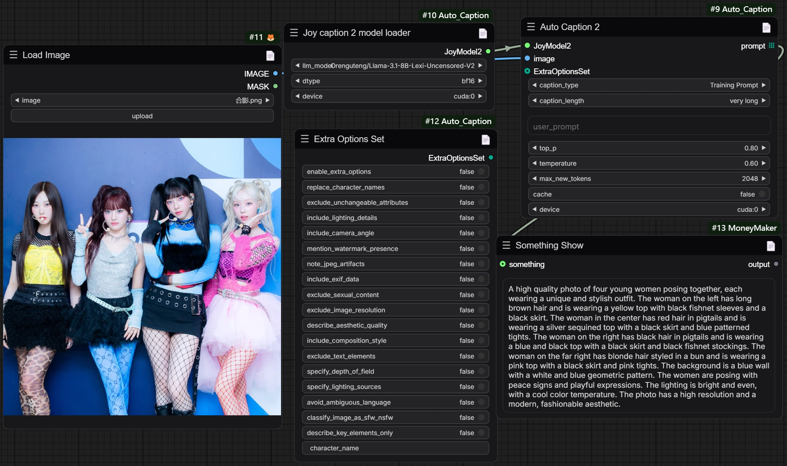
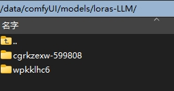
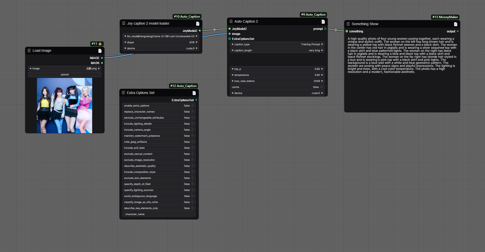

Update v1.0.2: Joy caption2 added.
# Introduction:
Joy Caption alpha 2 original demo and modelpackage:
https://huggingface.co/spaces/fancyfeast/joy-caption-alpha-two
the repo has taken some reference from: TTPlanetPig/Comfyui_JC2 and https://huggingface.co/John6666/joy-caption-alpha-two-cli-mod , appreciate！

# How to use

The main difference between the two versions is the use of LLM models versus LLM's LoRA models.

## 模型总目录 Base dir which models putin:  /comfyUI/models/ 

model types|    joy caption alpha                |          joy caption 2            |  coming soom  |            
-----------| ----------------------------------- | --------------------------------- | ------------- | 
clip_vision|clip_vision/siglip-so400m-patch14-384|         "same as alpha"           |               |  
LLM        |     LLM/Meta-Llama-3.1-8B-bnb-4bit  |LLM/Llama-3.1-8B-Lexi-Uncensored-V2|               |  
LLM2       |         Meta-Llama-3.1-8B           |  LLM/Meta-Llama-3.1-8B-Instruct   |               |  
  loras-LLM|      loras-LLM/wpkklhc6             | loras-LLM/cgrkzexw-599808         |               | 

Notice：Follow these three steps to get started
注意：完成下列三个步骤即可使用

1. 安装依赖requirements.txt(注意：transformers 版本不能太低, windows使用则需要安装windows 版本的相关依赖)    
   直接点击:install_req.bat 安装依赖  
   Click "install_req.bat" or use cmd code to install requirements, which are necessary. 

2. 运行自动下载模型(推荐手动下载)    
   Run the automatic download model (manual download is recommended)   

3. 将模型放在正确目录下    
    putin the correct path    
     
## 手动下载模型网址：Models download website:
(1). clip_vision
siglip:  https://huggingface.co/google/siglip-so400m-patch14-384   
>中国用户请使用: https://www.modelscope.cn/models/AI-ModelScope/siglip-so400m-patch14-384/files  

(2). loras-LLM——"必须手动下载 manual download only"：  

  *Joy caption alpha* : https://huggingface.co/spaces/fancyfeast/joy-caption-pre-alpha/tree/main/wpkklhc6  "放到putin" loras-LLM/wpkklhc6  
  >中国用户请使用: https://www.modelscope.cn/models/fireicewolf/joy-caption-pre-alpha/files  

  *Joy caption 2*  : https://huggingface.co/John6666/joy-caption-alpha-two-cli-mod    "放到putin"  loras-LLM/cgrkzexw-599808  
  >中国用户请使用: https://www.modelscope.cn/models/fireicewolf/joy-caption-alpha-two/files  

(3). LLM : "推荐手动下载 manual download"：   

### **Joy caption 2**  
*Llama-3.1-8B-Lexi-Uncensored-V2*： https://huggingface.co/unsloth/Meta-Llama-3.1-8B-Instruct  
>中国用户请使用：https://www.modelscope.cn/models/fireicewolf/Llama-3.1-8B-Lexi-Uncensored-V2/files    

*Meta-Llama-3.1-8B-Instruct*： https://huggingface.co/unsloth/Meta-Llama-3.1-8B-Instruct   
>中国用户请使用：https://www.modelscope.cn/models/LLM-Research/Meta-Llama-3.1-8B-Instruct/files    
    
### **Joy caption alpha**   
bnb-4bit: https://huggingface.co/unsloth/Meta-Llama-3.1-8B-bnb-4bit   
>中国用户请使用：https://www.modelscope.cn/models/unsloth/Meta-Llama-3.1-8B-Instruct-unsloth-bnb-4bit/files   
  
Llama-3.1-8B: https://huggingface.co/meta-llama/Llama-3.1-8B   
>中国用户请使用：https://www.modelscope.cn/models/LLM-Research/Meta-Llama-3.1-8B/files    

## 其他附加 Addition  
这个报告额外添加了一个“load many images”节点，它将按照图片名从小到大来加载图像，图像不再以错误的顺序加载（是优化版本的Load iamge dir）！！设置index=0使其从第一个图像（图像名称顺序）加载。    

This report contains a "load many images" node which is going to load the image set by the order of Num of image from smallest to largest, and the images are NO LONGER loaded in the wrong order！!! Setting index=0 makes it load from the first image (image flie name order).    

flux dev运行效果 Result runs by flux dev:   

   

反推效果展示 caption result screenshot:    
  
      
  
[caption2workflow](example_workflows/autocaption2workflow.json)    

   

## 路径截图 Path screenshot show  
#clip_vision path show:   

   

#loras-LLM path show:    

  
   
#LLM path show:   

   

  
## 示例工作流下载 example workflows download:  

auto caption 2 (joy2):   
  

auto caption (alpha):  
  

# Joy!  

*You can show something by this node report: https://github.com/Cyber-BlackCat/ComfyUI-MoneyMaker.git*     
